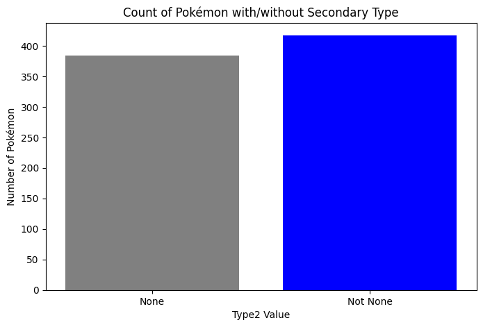
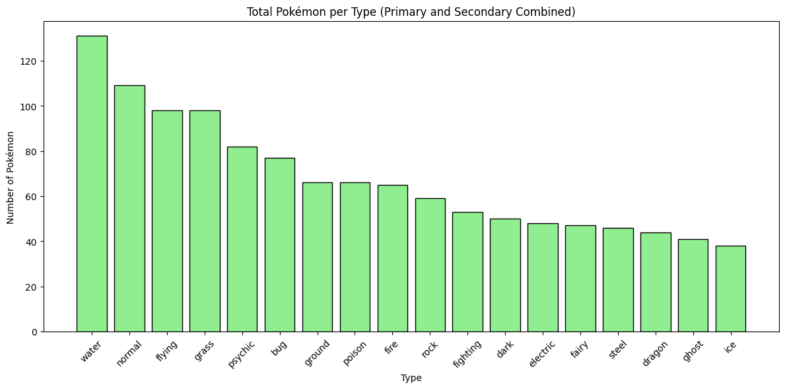
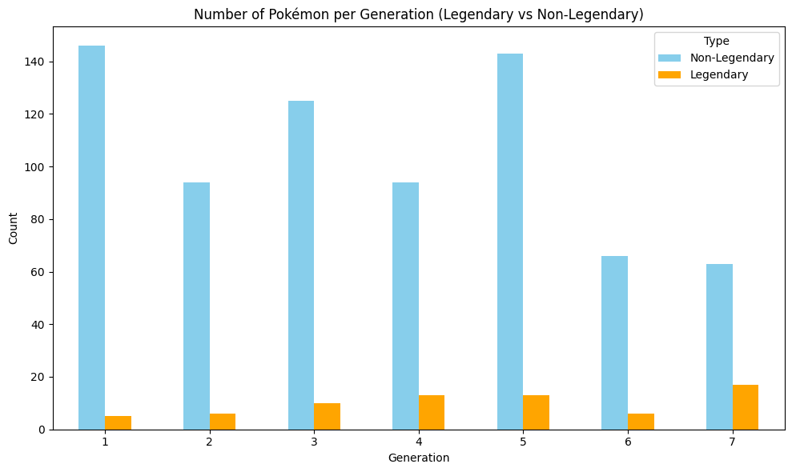
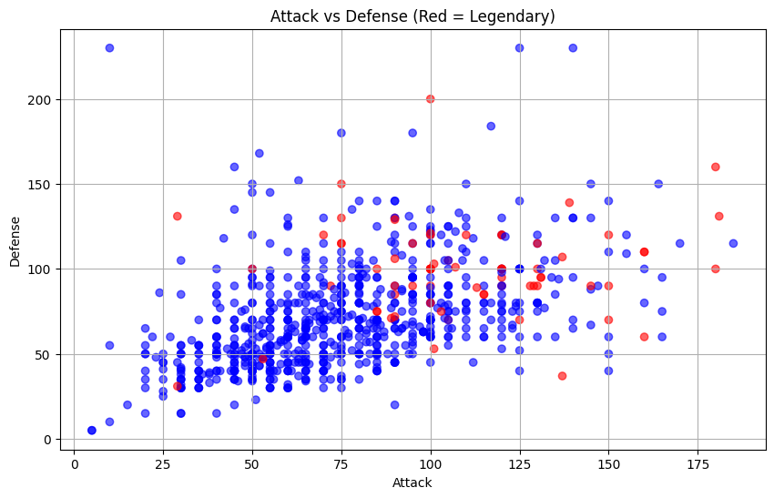
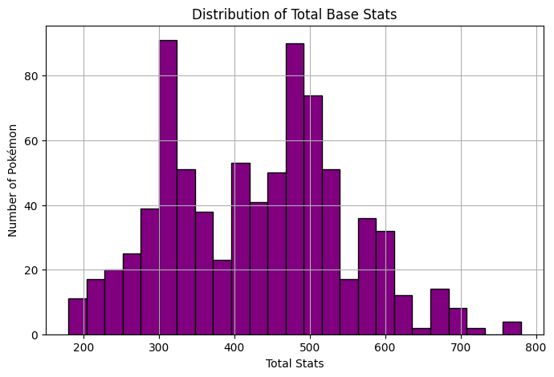
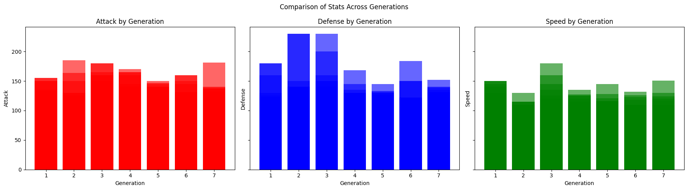
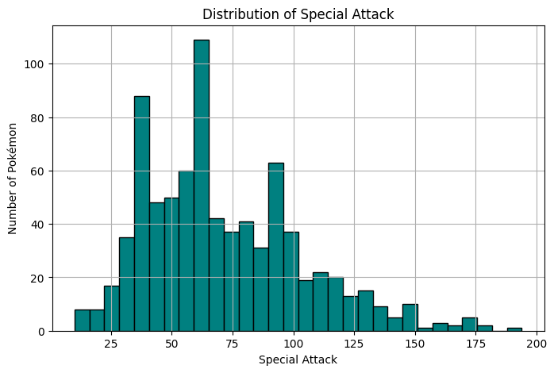
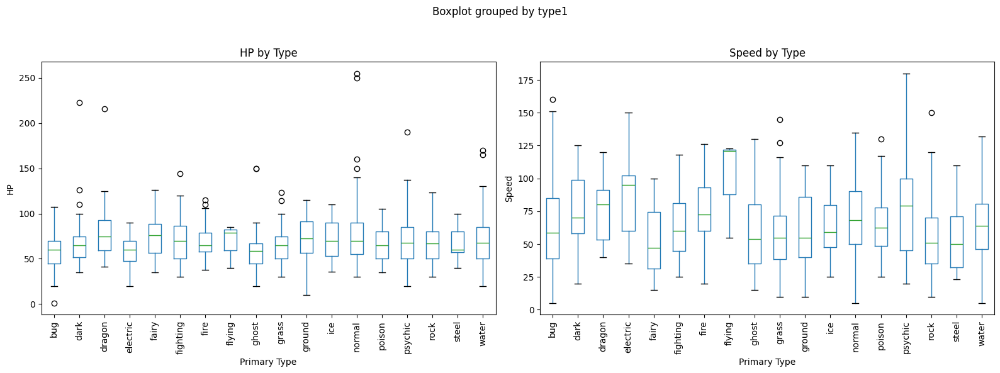

# 🧬 Pokémon Exploratory Data Analysis (EDA)

This project explores a cleaned dataset of Pokémon to uncover insights using visualizations. The analysis includes trends across generations, type distributions, base stats, and legendary status.

---

## 📦 Dataset
The dataset used is a cleaned version of the original Pokémon CSV:
- `cleaned_data_pokemon.csv`

---

## 🎯 Objectives

The following key questions were explored using visual analysis:

1. **How many Pokémon have a secondary type?**
2. **What are the most common Pokémon types overall (primary + secondary)?**
3. **How are legendary and non-legendary Pokémon distributed across generations?**
4. **How do legendary Pokémon differ in stats like Attack vs. Defense?**
5. **What is the distribution of total base stats?**
6. **How do Attack, Defense, and Speed vary across generations?**
7. **Does Special Attack show a multimodal distribution?**
8. **How do HP and Speed vary across different primary types?**

---

## 📊 Visualizations

### 1. Pokémon With/Without Secondary Type

### 2. Combined Type Distribution (Primary and Secondary)

### 3. Legendary vs Non-Legendary by Generation

### 4. Attack vs. Defense (Legendary Highlighted)

### 5. Distribution of Total Base Stats

### 6. Stats by Generation: Attack, Defense, Speed

### 7. Distribution of Special Attack

### 8. Boxplots of HP and Speed by Type

---

## 🛠️ Technologies Used

- Python
- Pandas
- Matplotlib
- Jupyter Notebook

---

## 📁 File Structure

